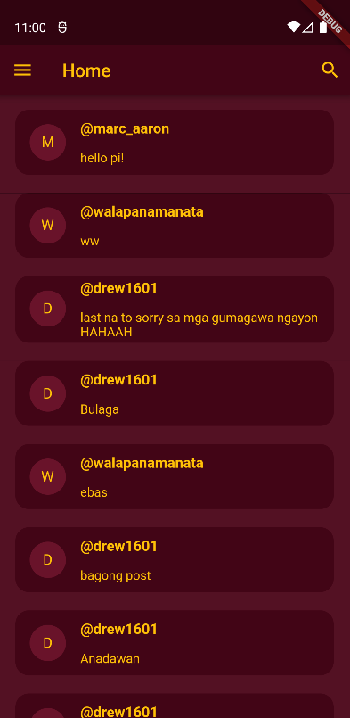

# Project Social Media App
### Bitancor, Marlon S.
### 2019 - 02087
### X-4L

### App Overview
> This is a simple social media application that lets the user do basic features such as account registration, login, logout, view the news
feed, create a post, and such. The app also consists of a sidebar for navigation through the whole application.

### App features
1. Register an Account

2. Login an Account

3. View Public Posts (with Pagination)

4. View Own Profile and Private Posts (with Pagination)

5. Edit a Post

6. Delete a Post

7. Update Your Profile and/or with or without Changing Password

8. Create a Public or For-Friends Post

9. View a Profile

10. View a Post

11. Viewing a Friend's Profile vs Non-Friend's Profile with Private Posts (with Pagination)

12. Logout Account

13. Friends List

14. Follow a User

15. Unfollow a Friend

